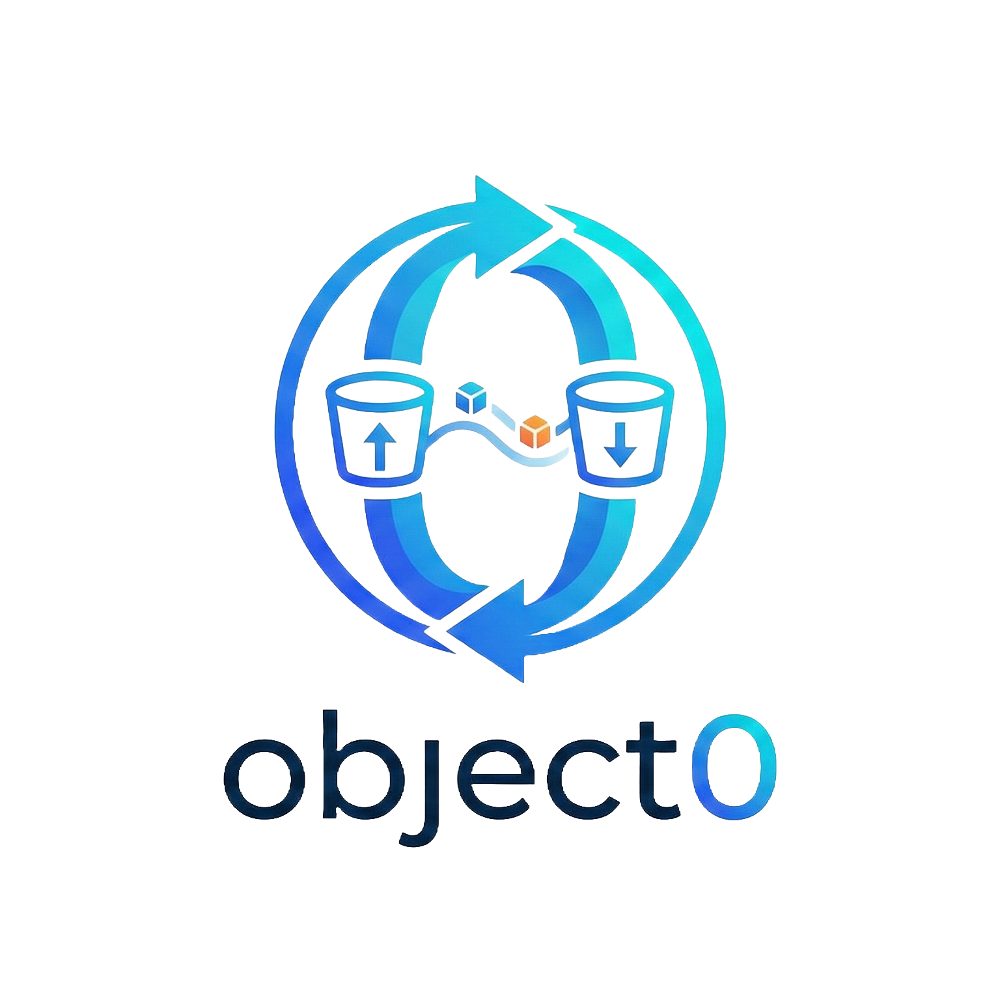

<div align="center">

# object0



**A free and open-source desktop S3 bucket manager.**

Manage objects across AWS S3, Cloudflare R2, DigitalOcean Spaces, MinIO, Backblaze B2, Google Cloud Storage, and any S3-compatible provider from a single, fast, cross-platform desktop app.

[](LICENSE)
[](https://github.com/sayedhfatimi/object0/releases)
[](#installation)

Built with [Tauri](https://tauri.app) · [Rust](https://www.rust-lang.org) · [Bun](https://bun.sh) · [React](https://react.dev) · [Tailwind CSS](https://tailwindcss.com) · [daisyUI](https://daisyui.com) · [Zustand](https://zustand.docs.pmnd.rs)

</div>

---

## Highlights

- **Multi-provider**: One app for all your S3-compatible storage
- **Encrypted vault**: AES-256-GCM encryption; API keys never leave the native backend
- **Folder sync**: Bidirectional, Google Drive-style sync with conflict resolution
- **Cross-platform**: Native builds for macOS, Linux, and Windows via Tauri
- **Fast transfers**: Multipart uploads, concurrent job queue, live progress events

## Table of Contents

- [Features](#features)
- [Installation](#installation)
- [Development](#development)
- [Architecture](#architecture)
- [Project Structure](#project-structure)
- [Scripts](#scripts)
- [License](#license)

## Features

<details>
<summary><strong>Storage & Profiles</strong></summary>

- Multi-provider profile support for AWS S3, Cloudflare R2, DigitalOcean Spaces, MinIO, Backblaze B2, GCS, and generic S3-compatible endpoints
- Encrypted vault persistence with passphrase-based unlock
- OS keychain integration for optional remembered unlock
- Profile test/validation and default bucket support

</details>

<details>
<summary><strong>Object Browser</strong></summary>

- Table and grid views
- Breadcrumb navigation and folder traversal
- Multi-select, object metadata, rename, delete, create-folder
- Favorites and bucket tabs with state restoration

</details>

<details>
<summary><strong>Transfers & Jobs</strong></summary>

- Upload/download (single and folder)
- Copy/move/cross-bucket transfers
- Archive download support
- Concurrent queue with progress, speed, ETA, cancel, and persisted history

</details>

<details>
<summary><strong>Sync</strong></summary>

- Bucket-to-bucket sync preview + execute
- Folder sync rules with status/conflict/error events
- Tray-aware background lifecycle for long-running sync work

</details>

<details>
<summary><strong>Sharing & UX</strong></summary>

- Presigned share links with expiration options
- QR code generation and share history
- Theme toggle, command palette, keyboard shortcuts, and toast notifications

</details>

## Installation

Download the latest release for your platform from the [Releases](https://github.com/sayedhfatimi/object0/releases) page.

| Platform | Architecture | Format |
|----------|-------------|--------|
| macOS | Apple Silicon, Intel | `.dmg` |
| Linux | x64 | `.AppImage` / `.deb` / `.rpm` |
| Windows | x64 | `.msi` / `NSIS .exe` |

## Development

### Prerequisites

- [Bun](https://bun.sh)
- [Rust toolchain](https://www.rust-lang.org/tools/install)
- Tauri platform dependencies: https://v2.tauri.app/start/prerequisites/
- Linux only: a Secret Service provider (for example KWallet or GNOME Keyring) for OS keychain unlock

### Setup

```bash
git clone https://github.com/sayedhfatimi/object0.git
cd object0
bun install
```

### Run (Web only)

```bash
bun run dev
```

### Run (Desktop app)

```bash
bun run dev:app
```

### Build

```bash
# Frontend typecheck + production bundle
bun run build

# Native desktop bundles (Tauri)
bun run build:app
```

## Architecture

```
┌──────────────────────────────────────────────┐
│                 Tauri Runtime                │
│                                              │
│  ┌──────────────┐     ┌──────────────────┐   │
│  │ Rust Backend │◄───►│  React Webview   │   │
│  │ (src-tauri)  │ IPC │  (src/mainview)  │   │
│  │              │     │                  │   │
│  │ • Vault      │     │ • Zustand stores │   │
│  │ • S3 ops     │     │ • UI components  │   │
│  │ • Job queue  │     │ • Tailwind/Daisy │   │
│  │ • Sync logic │     │                  │   │
│  └──────────────┘     └──────────────────┘   │
└──────────────────────────────────────────────┘
```

- **Rust backend (`src-tauri`)**: vault, profiles, S3 operations, queueing, folder sync, tray lifecycle, updater hooks
- **React frontend (`src/mainview`)**: application shell, stores, and typed RPC calls/events
- **Shared contracts (`src/shared`)**: RPC schema and shared types

## Project Structure

```
src/
├── main.tsx                # Vite entry
├── mainview/               # React UI
│   ├── app/
│   ├── components/
│   ├── hooks/
│   ├── lib/
│   └── stores/
└── shared/                 # RPC/types shared with backend

src-tauri/
├── src/
│   ├── main.rs             # native entry
│   └── lib.rs              # RPC router + backend runtime
├── capabilities/
└── tauri.conf.json
```

## Scripts

| Command | Description |
|---------|-------------|
| `bun run dev` | Start Vite dev server |
| `bun run dev:app` | Start Tauri desktop app in dev mode |
| `bun run build` | Type-check and build frontend |
| `bun run build:app` | Build desktop bundles with Tauri |
| `bun run check` | Run Biome checks |
| `bun run check:all` | Biome + frontend build + `cargo check` |
| `bun run lint` | Run Biome linter |
| `bun run format` | Format code with Biome |
| `bun run updater:manifest -- ...` | Build/merge static updater manifest |
| `bun run updater:verify -- ...` | Verify hosted updater manifest + artifact URL |

## License

[MIT](LICENSE)
